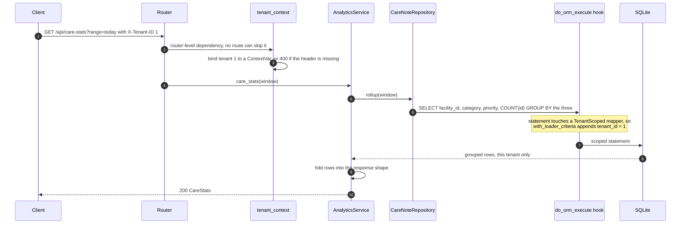
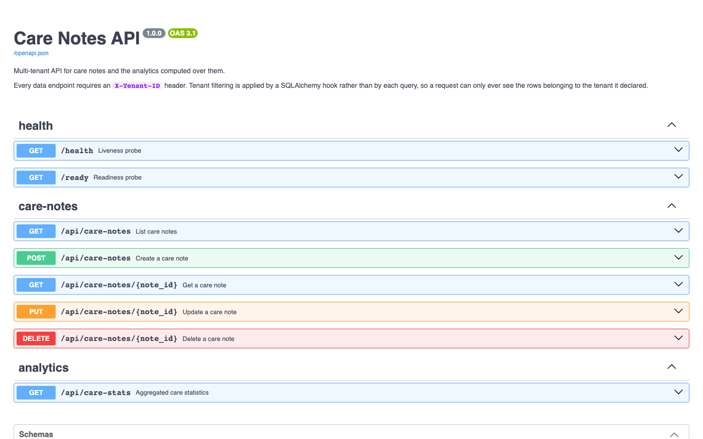
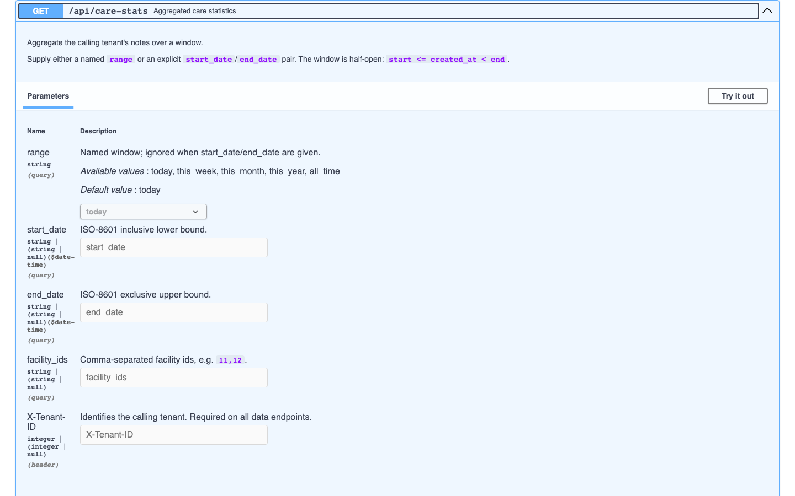

# Care Notes API

Several healthcare organisations keep their care notes in one table of one FastAPI
service, which makes isolation rather than throughput the design problem: the day a
query forgets `WHERE tenant_id = ...` is the day one organisation reads another's
clinical records. So no query here writes that predicate — a SQLAlchemy hook adds
it, and a query issued with no tenant bound raises instead of scanning the table.
The rest is deliberately small: a CRUD resource, a `GROUP BY` analytics rollup, a
cache seam. A backend take-home.

## Where isolation is actually enforced

`CareNote` inherits `TenantScoped` (`app/core/tenancy.py`). A `do_orm_execute`
listener on `Session` notices any SELECT whose mappers include a `TenantScoped` class
and appends the predicate through `with_loader_criteria`, reading the tenant from a
`ContextVar` bound by a **router-level** FastAPI dependency, so no individual route
can forget to declare it.



Three consequences, each named by a test:
a filter-less query still comes back scoped
(`test_query_forgetting_the_filter_is_still_scoped`); a query run with **no tenant
bound raises** `MissingTenantContextError`, so a mistake fails loudly instead of
reading the whole table (`test_query_without_tenant_context_raises`); and escaping
requires `unscoped()`, so `grep -rn unscoped app/` enumerates every suspension of
the guarantee — the seeder and `scripts/benchmark.py`.

Two properties the design rests on are asserted, not assumed.
`test_aggregates_are_scoped_too` covers `select(func.count(...))` and `GROUP BY`
column selects, because a mechanism scoping `select(CareNote)` but not `count()`
would leak totals while looking safe. `test_scope_switches_cleanly_between_tenants`
alternates tenants 1, 2, 1, 2, 1 and re-checks each count, because SQLAlchemy
caches compiled statements and a tenant id baked into a cached plan would be
catastrophic.

Writes are guarded differently: `CareNoteCreate` **has no `tenant_id` field**, so a
payload has nothing to forge
(`test_tenant_id_in_the_body_cannot_override_the_header`). The hook sees only
SELECTs, so `DELETE` was the remaining hole — `CareNoteRepository.delete` resolves
the row through the scoped `get()` first. Cross-tenant reads answer **404, not
403**; a 403 confirms the id exists for somebody else.

### The caveat that matters: isolation is not authentication

The tenant arrives in a **client-supplied `X-Tenant-ID` header** and anyone can set
it to any value. The machinery above is correct and centralised, and it stops a
*bug* from crossing tenants — it does nothing about a *caller* who simply claims to
be tenant 2. That header must become a verified JWT claim before this service goes
near real data. Everything downstream reads the tenant from context rather than
transport, so that is a one-dependency change — but it has not been made, and
nothing here should be read as if it had.

## Proof, from a running container

From `docker compose up --build`, seeded with 20,000 synthetic notes across three
tenants. Tenant 1 owns facilities 11-14, tenant 2 owns 21-24, and neither appears in
the other's rollup (other keys elided for width):

```console
$ curl -s -H 'X-Tenant-ID: 1' 'http://localhost:8160/api/care-stats?range=all_time'
{"tenant_id":1,"total_notes":6672,"unique_patients":100, ... ,
 "by_facility":{"11":1682,"12":1674,"13":1692,"14":1624}}

$ curl -s -H 'X-Tenant-ID: 2' 'http://localhost:8160/api/care-stats?range=all_time'
{"tenant_id":2,"total_notes":6571,"unique_patients":100, ... ,
 "by_facility":{"21":1654,"22":1603,"23":1641,"24":1673}}
```

Note 18317 belongs to tenant 2 and returns 200 for it. Tenant 1 asking for the same
id, then a request with no header at all:

```console
$ curl -s -w '\nHTTP %{http_code}\n' -H 'X-Tenant-ID: 1' \
    http://localhost:8160/api/care-notes/18317
{"detail":"Care note not found."}
HTTP 404
$ curl -s -w '\nHTTP %{http_code}\n' http://localhost:8160/api/care-notes
{"detail":"Missing required X-Tenant-ID header."}
HTTP 400
```

`pytest` is 86 tests over in-memory SQLite, no services needed: 21 in
`tests/test_tenant_isolation.py`, plus the aggregation fold and calendar edges (26),
CRUD and its validation matrix (26), seed guarantees (5), probes and schema (4) and
PHI containment (4).

## What is in the table

One table, `care_notes`: `id`, `tenant_id` (from the `TenantScoped` mixin),
`facility_id`, `patient_id`, `category` (medication, observation or treatment),
`priority` (1-5, validated), `created_at`, `created_by` and `note_content` — the
last three of those being the PHI columns that never reach a log. `tenant_id`,
`facility_id` and `patient_id` are plain identifier columns: there is no tenant,
facility or patient table and no identity resolution, which is a documented gap
rather than an oversight.

Every access path starts with a tenant, so `tenant_id` leads all three indexes:
`(tenant_id, created_at)` for the default listing — filter, then order;
`(tenant_id, facility_id, created_at)` for the analytics rollup and
facility-filtered lists; `(tenant_id, patient_id, created_at)` for per-patient
history.

## Run it

```bash
docker compose up --build        # schema, seed, and uvicorn on host port 8160
curl -s -H 'X-Tenant-ID: 1' 'http://localhost:8160/api/care-stats?range=all_time'
docker compose down -v           # including the seeded volume
```

The image was built and booted during development: `docker compose build` and
`docker compose up -d` both succeeded, the container reached `healthy` and served
the traffic captured above on port 8160, and `docker compose restart` logged
`Database already holds 20000 notes; skipping seed` with tenant totals unchanged
— seeding is idempotent, so a restart neither duplicates nor destroys data.

Without Docker:

```bash
python -m venv .venv && source .venv/bin/activate
pip install -r requirements-dev.txt
python -m app.seed --count 20000            # explicit; never runs at startup
uvicorn app.main:app --reload --port 8160
```

Then <http://localhost:8160/docs> for the interactive contract and `/health` and
`/ready` for probes. Also `pytest` (or `pytest tests/test_tenant_isolation.py -v`),
`ruff check .`, `python -m scripts.benchmark`.



## The analytics path

`GET /api/care-stats` aggregates one tenant's notes along facility, category and
priority over a window. The obvious implementation issues a query per dimension;
this one issues a single `GROUP BY facility_id, category, priority` and folds the
rows into the response shape in Python — one scan, and a result set bounded by
`facilities x categories x priorities` whether the window holds a thousand notes or
ten million. The distinct-patient count stays a second query, since a distinct
count across groups is not derivable from per-group counts, and
`test_rollup_issues_one_query_per_dimension_set` counts executed statements so the
optimisation cannot silently regress.

`scripts/benchmark.py` keeps a naive load-and-count-in-Python implementation as a
baseline, runs both over the *same* window, and **asserts the two results equal
before reporting any timing**. One in-container run, 20,000 rows seeded and 6,668
in the window (it prints fresh numbers each time):

```console
Rows in window (tenant): 6,668
Iterations             : 10
Results agree          : yes
Naive (load + count in Python) :    47.13 ms  (median 42.33 ms)
SQL rollup (2 queries)         :    12.94 ms  (median 12.91 ms)
Speed-up                       :     3.64x
```

Windows are half-open, `start <= created_at < end`, avoiding both the dropped final
microsecond and the overlap that closed `23:59:59.999999` ranges produce, and are
filtered with range comparisons rather than `func.date(created_at) == ...` so the
leading index column stays usable. `page_size` is **clamped** to `MAX_PAGE_SIZE`
rather than rejected, so `?page_size=100000` returns 100 notes instead of an error
or the whole table; `facility_ids` is capped at 100; the cache is LRU-bounded,
since its keys include client-supplied date ranges.



### The cache is a seam, not a dependency

`AnalyticsService` depends on `AnalyticsCache`, a `Protocol` in `app/core/cache.py`,
with `NullCache` and `InMemoryTTLCache` behind it and `build_cache()` selecting one
from config (`ANALYTICS_CACHE_TTL_SECONDS=0` disables caching entirely). Where a
cache belongs is a deployment decision — in-process for one container, Redis for
several behind a balancer — so adding Redis is one class and one line in
`build_cache()`, with no change to the service, the router or the tests. Keys are
built only by `stats_cache_key()`, tenant id first: a shared cache with a
tenant-blind key would reintroduce the leak through the back door, so callers do
not build keys, and `test_analytics_cache_does_not_leak_between_tenants` asserts
two tenants asking the identical question get two entries.

## Clinical data handling

All fixture and seed data is **transparently synthetic**: patient identifiers look
like `P-T1-F11-001`, note bodies begin `SYNTHETIC FIXTURE`, and
`tests/test_seed.py` asserts both. No real or realistic patient data is in this
repository. `patient_id`, `created_by` and `note_content` are never logged, and
`CareNote.__repr__` omits them because reprs surface in tracebacks. Error bodies are
generic — a 500 says `"Internal server error."`, the detail goes only to the log.
`app/core/logging.py` states the rule and supplies `scrub()`;
`tests/test_phi_safety.py` drives the real read paths at `DEBUG` and asserts that no
patient identifier or note body reaches a log record, and that a forced internal
error leaks nothing to the client.

## Configuration

Everything is read from the environment via `app/config.py` and every value has a
working default, so the service boots with no configuration at all; `.env.example`
lists the full set. The ones that change behaviour: `DATABASE_URL` (any async
driver, default `sqlite+aiosqlite:///./carenotes.db`), `MAX_PAGE_SIZE` (`100`, the
clamp ceiling), `ANALYTICS_CACHE_TTL_SECONDS` (`30`, where `0` selects `NullCache`)
and `ANALYTICS_CACHE_MAX_ENTRIES` (`512`, before LRU eviction). The `SEED_*`
variables size the dataset `python -m app.seed` builds, and `SEED_ON_START` is read
by the Docker entrypoint only, never by the app. Structurally: routers → services →
repositories → models, dependencies inward only, cross-cutting concerns in
`app/core`, every SQL statement in `app/repositories/care_notes.py`. Start with
`app/core/tenancy.py`.

## Known gaps

- **No authentication**, as set out above — the one thing standing between this and
  a deployment.
- **No authorisation inside a tenant, and no audit log.** Any caller for tenant 1
  can read and modify every note in tenant 1: no roles, no per-facility
  permissions, no record of who read what, no rate limiting.
- **SQLite only.** The code is engine-agnostic and `DATABASE_URL` takes any async
  driver, but only SQLite has been run; Postgres would need `asyncpg` and the schema
  verified, and claiming "PostgreSQL-ready" without doing so is the kind of untested
  claim this README is trying to avoid.
- **No migrations.** Schema changes go through `create_all`, so adding a column today
  would not alter an existing database. Alembic is the right answer.
- **Offset pagination.** Deep pages (`?page=50000`) still walk the skipped rows.
  Keyset pagination on `(created_at, id)` would fix it, and the ordering index
  already supports it.
- **The cache is per-process and never invalidated** — TTL only, so a new note can be
  missing from stats for up to `ANALYTICS_CACHE_TTL_SECONDS`, and each replica holds
  its own copy. Fine for a dashboard, wrong for read-your-writes.
- **No soft deletes.** `DELETE` is permanent, rarely what a clinical record system
  wants.
